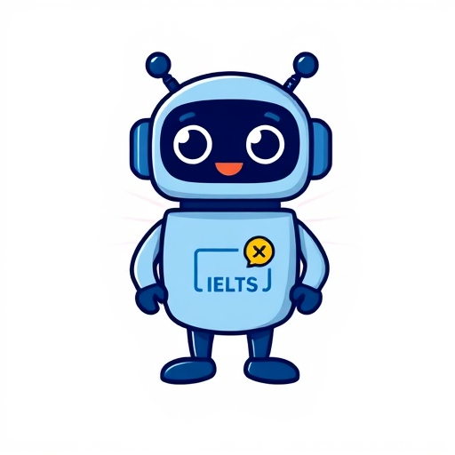

# IELTS Writing Assistant



The IELTS Writing Assistant is an intelligent tool designed to help IELTS candidates practice and improve their writing skills for the exam. By analyzing user-provided answers to both Task 1 and Task 2 writing prompts, the system offers detailed feedback on common mistakes, suggests improvements, and provides actionable tips for enhancing overall writing quality.

## Features

1. **Input Handling**:
   - Accepts Task 1 and Task 2 questions as text input.
   - It allows users to upload task 1 images.

2. **Automated Writing Analysis**:
   - Analyzes user-provided answers for both tasks.
   - Identifies and highlights grammatical errors, vocabulary issues, and stylistic improvements.
   - Provides correction suggestions with detailed explanations.
   - Recommends advanced phrasing and structure adjustments for scoring higher points.

3. **Future Development**:
   - The next phase of the project will introduce exercise-based learning, where users engage in interactive training exercises.
   - Exercises will be dynamically tailored to individual users based on their past mistakes and weak areas.
   - The goal is to create a personalized training plan to systematically improve user performance.

## Getting Started

### Prerequisites

- Python 3.7 or higher
- Required libraries are listed in `requirements.txt` (for NLP and Telegram-bot)

### Installation

1. **Clone the repository**:
   ```bash
   git clone https://github.com/yourusername/IELTS-writing-assistant.git